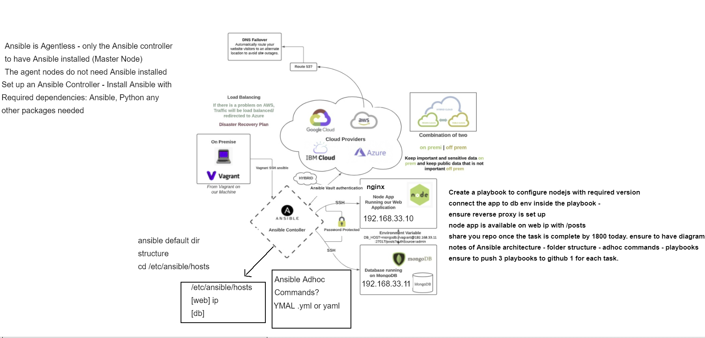

# Infrastructure as Code with Ansible

## Controller Setup
SSH in box
```
vagrant ssh (box name)
```

```
sudo apt-get update -y
sudo apt-get upgrade -y
sudo apt-get install software-properties-common -y
sudo apt-add-repository ppa:ansible/ansible
sudo apt-get install ansible -y
```
### Connecting to Servers with Ansible
To make viewing files easier
```
sudo apt-get install tree -y
```
To SSH into the different boxes from ansible from /etc/ansible
```
ssh vagrant@boxIP(in Vagrantfile)
```

Add new /etc/ansible/hosts file
```
sudo rm -rf hosts
sudo nano hosts
```
add into the hosts file
```
[web]
192.168.33.10 ansible_connection=ssh ansible_ssh_user=vagrant ansible_ssh_pass=vagrant 

[db]
192.168.33.11 ansible_connection=ssh ansible_ssh_user=vagrant ansible_ssh_pass=vagrant

```
To ping all servers from ansible (/etc/ansible)
```
# replace all with name of server to ping individually
ansible all -m ping
```
### Ansible adhoc commands
Allow you to run commands on the agent nodes from the controller
e.g.
```
ansible web -a "hostnamectl"
ansible web -a "uname -a"
ansible db -a "date"
ansible db -a "free"
ansible web -m shell -a "ls -a"
```
checking uptime of servers
```
ansible all -m shell -a uptime
```
installing nginx on web server
```
ansible web -a "sudo apt-get install nginx -y
```

## Ansible Playbook
- Create new file `nginx.yml` in /etc/ansible
```
# nginx setup playbook on web with reverse proxy

# Note - ensure the node-app and mongodb required dependencies are available in the specified location---
---
    - hosts: web
    
      gather_facts: true
    
      become: true
    
      tasks:
      - name: Install nginx
        apt: pkg=nginx state=present
        become_user: root
    
      - name: Remove nginx default file (delete file)
        file:
          path: /etc/nginx/sites-enabled/default
          state: absent
    
      - name: Touch a file, using symbolic modes to set the permissions (equivalent to 0644)
        file:
          path: /etc/nginx/sites-enabled/reverseproxy.conf
          state: touch
          mode: '666'
    
    
      - name: Insert multiple lines and Backup
        blockinfile:
          path: /etc/nginx/sites-enabled/reverseproxy.conf
          block: |
            server{
              listen 80;
              server_name development.local;
              location / {
                  proxy_pass http://127.0.0.1:3000;
              }
            }
      - name: Create a symbolic link
        file:
          src: /etc/nginx/sites-enabled/reverseproxy.conf
          dest: /etc/nginx/sites-available/reverseproxy.conf
          state: link
    
      - name: nginx bug workaround
        shell: |
          sudo mkdir /etc/systemd/system/nginx.service.d
            printf "[Service]\nExecStartPost=/bin/sleep 0.1\n" | \
              sudo tee /etc/systemd/system/nginx.service.d/override.conf
          sudo systemctl daemon-reload
          sudo systemctl restart nginx
```
- Run the playbook
```
ansible-playbook nginx.yml
```
- Check nginx status
```
ansible web -a "systemctl status nginx"
```
- Create `mongo.yml` in /etc/ansible
```
# mongodb_setup.yml
# Note - Ensure the node-app and mongodb required dependencies are available in the specified location
---

    - hosts: db
    
      gather_facts: yes
    
      become: true
    
      tasks:
      - name: install mongodb
        apt: pkg=mongodb state=present
    
      - name: Remove mongodb file (delete file)
        file:
          path: /etc/mongodb.conf
          state: absent
    
      - name: Touch a file, using symbolic modes to set the permissions (equivalent to 0644)
        file:
          path: /etc/mongodb.conf
          state: touch
          mode: u=rw,g=r,o=r
    
    
      - name: Insert multiple lines and Backup
        blockinfile:
          path: /etc/mongodb.conf
          block: |
            # mongodb.conf
            storage:
              dbPath: /var/lib/mongodb
              journal:
                enabled: true
            systemLog:
              destination: file
              logAppend: true
              path: /var/log/mongodb/mongod.log
            net:
              port: 27017
              bindIp: 0.0.0.0
      - name: Restart mongodb
        become: true
        shell: systemctl restart mongodb
    
      - name: enable mongodb
        become: true
        shell: systemctl enable mongodb
    
      - name: start mongodb
        become: true
        shell: systemctl start mongodb
```
- run the mongo playbook
```
ansible-playbook mongo.yml
```
- Check mongodb status
```
ansible db -a "systemctl status mongodb"
```
- Create `nodejs.yml`
```
# node_app_playbook.yml
# This is a YAML file to install node-app onto our web using YAML
---


- name: start mongodb
  import_playbook: mongodb_setup.yml


# where do we want to install


#  tasks:
- name: Install nginx
  import_playbook: nginx_setup.yml


# Install node js and NPM

- hosts: web
  gather_facts: true
  become: true


  tasks:
  - name: Install nodejs
    apt: pkg=nodejs state=present

  - name: Install NPM
    apt: pkg=npm state=present

  - name: download latest npm + Mongoose
    shell: |
      npm install -g npm@latest
      npm install mongoose -y
# Downloading pm2
  - name: Install pm2
    npm:
      name: pm2
      global: yes


  - name: seed + run app
    shell: |
      cd app/
      npm install
      node seeds/seed.js
      pm2 kill
      pm2 start app.js
    environment:
# This is where you enter the environment variable to tell the app where to look for the db
      DB_HOST: mongodb://ubuntu@<ENTER DB IP HERE>:27017/posts?authSource=admin
    become_user: root
```
### Ansible Controller and Agent nodes set up with Vagrant
```
# -*- mode: ruby -*-
# vi: set ft=ruby :

# All Vagrant configuration is done below. The "2" in Vagrant.configure
# configures the configuration version (we support older styles for
# backwards compatibility). Please don't change it unless you know what

# MULTI SERVER/VMs environment
#
Vagrant.configure("2") do |config|

# creating first VM called web
  config.vm.define "web" do |web|

    web.vm.box = "bento/ubuntu-18.04"
   # downloading ubuntu 18.04 image

    web.vm.hostname = 'web'
    # assigning host name to the VM

    web.vm.network :private_network, ip: "192.168.33.10"
    #   assigning private IP

    config.hostsupdater.aliases = ["development.web"]
    # creating a link called development.web so we can access web page with this link instread of an IP

    end

# creating second VM called db
  config.vm.define "db" do |db|

    db.vm.box = "bento/ubuntu-18.04"

    db.vm.hostname = 'db'

    db.vm.network :private_network, ip: "192.168.33.11"

    config.hostsupdater.aliases = ["development.db"]
    end

# creating are Ansible controller
  config.vm.define "controller" do |controller|
    
    controller.vm.box = "bento/ubuntu-18.04"
    
    controller.vm.hostname = 'controller'
    
    controller.vm.network :private_network, ip: "192.168.33.12"
    
      
  end
end
```